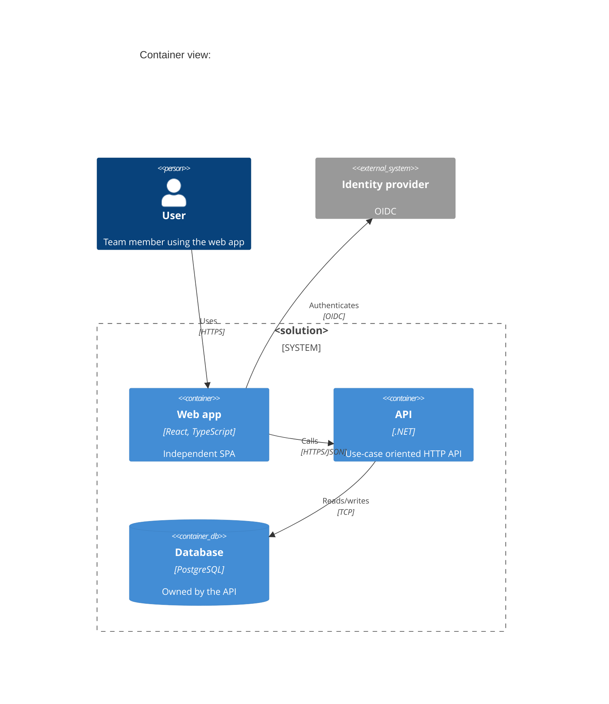

# Architecture views with the C4 model

Baseline: 1.0.0. Applies when: a solution document, ADR, or onboarding page needs a diagram

Decision: [ADR-0029](../adr/0029-split-into-domain-handbooks.md). This document is guidance; it adds no rules. The solution document rules (SA-*) require boundaries and dependencies to be recorded, and C4 is the default notation for doing so.

## Which views to produce

| Level | Shows | Produce it when | Owner |
| --- | --- | --- | --- |
| 1. System context | The system, its users, and external systems | Always, in the solution document | Solution owner |
| 2. Container | Deployable units (SPA, API, worker, database, queue) and their protocols | Always, in the solution document | Solution owner |
| 3. Component | Major modules inside one container | A container has more than a handful of modules or a boundary is contested | Application owner |
| 4. Code | Classes and functions | Rarely; generate from code if ever | Nobody by hand |

Add a **deployment** view (containers mapped to Fly.io apps, regions, volumes, and managed services) when hosting matters for the decision. Add a **dynamic** view (one sequence) for a flow that crosses three or more containers.

## Rules of thumb

- Every box has a name, a technology, and one sentence of responsibility. Every arrow has a label (what, over which protocol).
- Show trust boundaries (browser, internet, private network) as dashed regions; they drive the security handbook's review triggers.
- One diagram answers one question. If it needs a legend longer than three items, split it.
- Keep diagrams next to the document they support and in a text format (Mermaid or Structurizr DSL) so they diff in pull requests.

## Mermaid starting point

## Relationship to other documents

- [Solution architecture](solution-architecture.md) and [solution design](solution-design-standard.md) say what must be decided; the views make those decisions visible.
- [Service boundaries](service-boundaries-reference.md) helps decide what becomes a container.
- Threat models in the [security handbook](https://github.com/Slight76/security-standards/blob/main/docs/threat-modeling-guide.md) start from the container view's trust boundaries.
