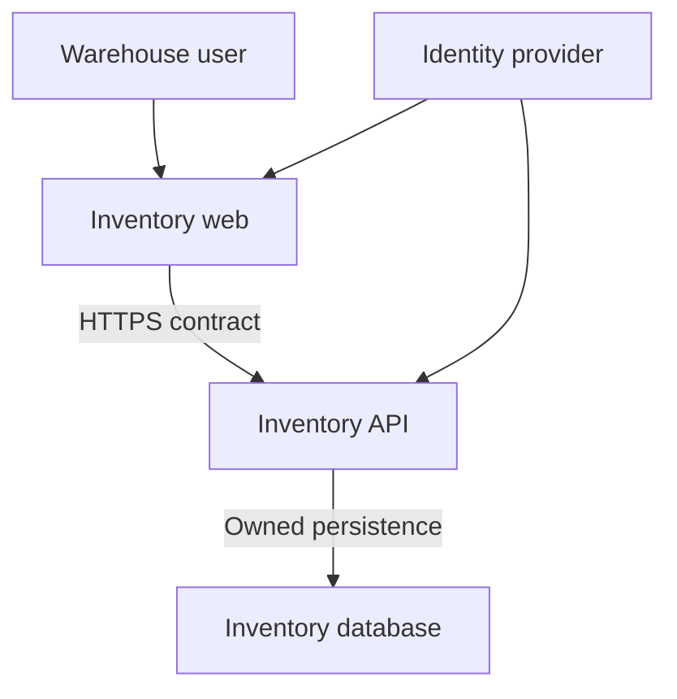

# Inventory solution example

Illustrative only; not a deployed or approved business system.

Independent repositories: inventory-web and inventory-api. A relational store is owned by inventory-api. No worker, queue, cache, or orchestrator is required until a use case justifies it.

This is a container view. A context view would show Inventory as one system connected to users and the identity provider.

| Concern | Applicable rules | Decision/evidence |
| --- | --- | --- |
| Independent deployments | FE-001 | ADR-0010; separate pipeline and rollback |
| Stock quantity invariant | BE-001, BE-004 | Domain rejects invalid stock; use-case tests |
| Concurrent adjustments | DB-002, INT-003 | Local ADR chooses concurrency strategy; contention and retry tests |
| Resource permissions | SEC-001 | API tests deny unauthorized warehouse access |
| Compatibility | INT-001, INT-002 | Pin OpenAPI artifact; test old client with new API |
| Recovery | DB-005, INF-003 | Owner sets targets; isolated restore exercise |

Owners, targets, identity design, deployment platform, schema, runtime versions, and concrete concurrency strategy are deliberately unresolved example inputs. Before production, replace each with an approved solution decision and evidence.
