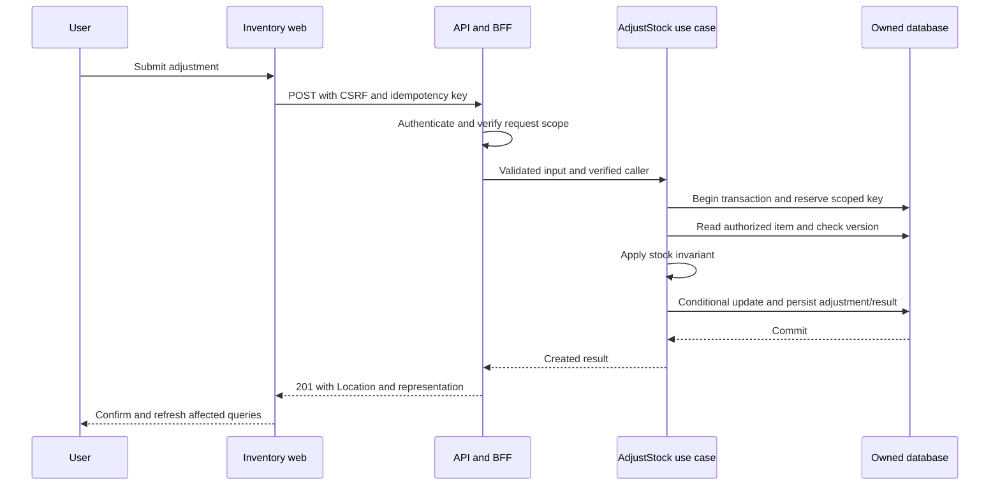

# Worked solution: stock adjustment

Illustrative design, not a deployed application. This example shows how standards guide one feature across independent repositories. Business owners, production origins, targets, versions, and approvals must be supplied before implementation/release. Code/schema fragments have not been compiled or executed here.

## Scope and deployment

`inventory-web` owns React UI and its pipeline; `inventory-api` owns API/BFF, use cases, persistence and its pipeline. They can share a public origin through edge routing: `/` serves static web assets and `/api` routes to the API. This keeps repository/release separation while making browser API calls same-origin. Therefore this example does not enable CORS. If direct access from another approved browser origin is added, use the CORS standard and update the threat model.

The API owns stock items and adjustment records. No queue, worker, or cache is needed for the initial adjustment. Add an outbox/worker only when reliable external synchronization becomes a requirement.

## Design decisions and traceability

| Decision | Example choice | Governing rules |
| --- | --- | --- |
| Release boundaries | Separate web/API artifacts and compatibility matrix | FE-001, CICD-003 |
| Browser session | Same-origin BFF; Secure/HttpOnly cookie and antiforgery checks | IAM-001, IAM-003, CORS-001 |
| Endpoint | POST /api/v1/stock-items/{id}/adjustments | API-001, CON-003 |
| Authorization | inventory.adjust plus authorized warehouse tenant scope | IAM-002, SEC-001 |
| Mutation contract | Idempotency-Key and a body expectedVersion for the item | RES-002, API-004 |
| Atomicity | Stock update, adjustment, audit and replay result in one transaction | DATA-002, BE-007 |
| Client behavior | Confirmed result, then invalidate item/list queries | FE-007, FE-009 |
| Operations | Safe adjustment outcome metric and trace; no raw reasons in logs | OBS-001 |

The nested adjustment creates a new resource and affects the parent item. Here expectedVersion is an explicit application field checked against the parent item; stale version returns 409. For direct item PUT/PATCH, the HTTP standard instead uses an item ETag and If-Match with 412. Do not apply an item ETag as if it automatically describes the adjustment collection.

## Request and result

```http
POST /api/v1/stock-items/item-17/adjustments
Content-Type: application/json
Idempotency-Key: client-generated-opaque-key
X-CSRF-TOKEN: session-bound-antiforgery-token

{"delta":-2,"reason":"Damaged packaging","expectedVersion":"7"}
```

The CSRF header name is an example chosen by the configured antiforgery implementation, not a literal token. Authentication cookie is sent by the browser under the session policy. Tenant and actor are resolved by the server, not accepted from the body.

Success: 201, Location to the new adjustment, representation containing adjustment ID and new quantity/version. Validation: 400. Insufficient rights: 403 or the solution's consistent concealment policy. Stale parent version or insufficient stock: 409 with distinct stable problem codes. Duplicate key with different content: 409. A valid replay returns the stored successful result after authorization is rechecked.

## Critical sequence



A replay branches before executing the business mutation. Unique key conflicts and stale versions are handled explicitly; this happy-path view does not replace the failure tests below.

## Data model sketch

`stock_items`: id, tenant_id, warehouse_id, sku, quantity, version, updated_at.

`stock_adjustments`: id, tenant_id, stock_item_id, delta, reason, actor_id, created_at.

`request_results`: tenant_id, principal_id, operation, idempotency_key, request_fingerprint, status, response_reference, expires_at.

Constraints: scoped SKU uniqueness; nonnegative quantity; parent/child references cannot cross tenant; unique scoped idempotency key. Choose numeric/integer quantity semantics based on the actual inventory unit. Limit reason length and classify its contents. Retention for adjustments, audit, and replay results is separate and owner-defined.

## Implementation map

| Repository/layer | Responsibilities |
| --- | --- |
| Web feature | Adjustment form/schema, mutation hook, accessible errors, confirmed result |
| Web API adapter | Generated client, session/CSRF transport, stable problem mapping |
| API | DTO validation, identity/authorization boundary, response mapping |
| Application | Use-case transaction, scope check, durable replay orchestration |
| Domain | Quantity/invariant transition |
| Infrastructure | Atomic conditional write, constraints, transaction, replay/audit persistence |

Do not publish from a React component directly to a message broker or bypass the use case with an endpoint SQL update.

## Acceptance cases

1. Authorized user subtracts two from twelve; one adjustment exists and the new quantity is ten.
2. Another tenant's ID is supplied; no stock or adjustment data is disclosed or changed.
3. Two different requests use version seven concurrently; only one succeeds, the other receives a conflict.
4. The same scoped key and payload arrive concurrently; one committed effect and a consistent replay result.
5. The response is lost after commit; retry returns the original adjustment, not a second mutation.
6. The same key is reused with another delta; 409, no new effect.
7. Audit/result persistence fails before commit; stock and adjustment roll back.
8. CSRF protection is missing/invalid; cookie-authenticated mutation is denied.
9. Frontend receives 409/403/network failure; input is preserved where safe, no false success, focus/error announcement is usable.
10. Old web client runs against new API and expanded schema; supported behavior remains valid.

## Release and operations

Publish compatible API/contract first; regenerate/pin the web client independently. Record supported combinations before removing fields. Migration rehearsal creates constraints and replay storage before enabling the endpoint. Observe adjustment outcomes and latency without logging raw reasons or cookies. The rollback plan chooses an API version compatible with the current schema. Recovery exercise verifies stock/adjustment consistency as well as restoring rows.

Open inputs: actual owners, identity provider, permissions, public origins, session lifetimes, data retention, workload/capacity, deadlines, SLO/RPO/RTO, hosting and package versions. These are explicit inputs, not defaults inferred from this example.
